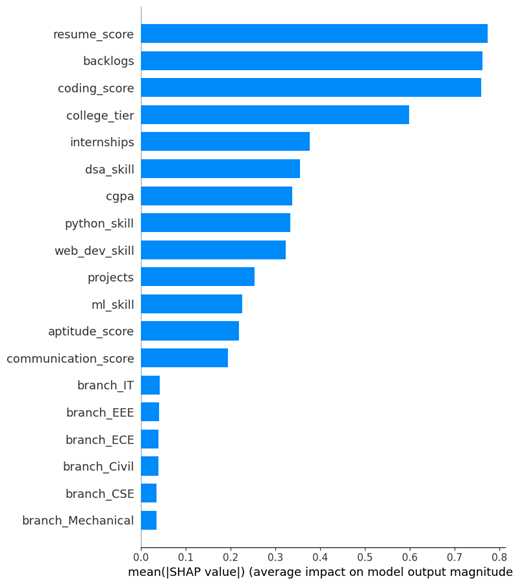
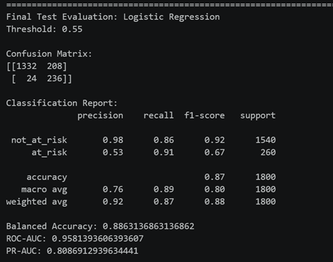
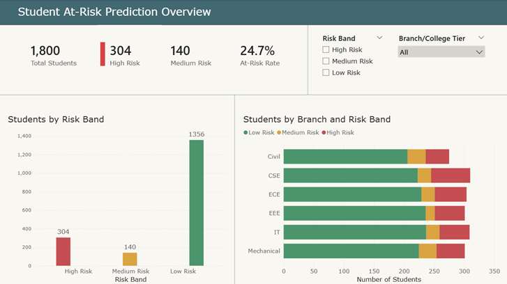
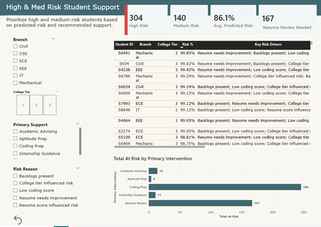

# Student Placement Risk Prediction Using Machine Learning

This repository contains a **capstone Machine Learning project** designed as a decision-support prototype for a **Career Development Cell (CDC)**. 

The system predicts whether a student may be at risk of not securing a placement, helping career support staff identify students who may benefit from earlier support before placement or recruitment activities begin.

**Primary notebook:** `capstone_student_placement_risk_prediction.ipynb`

## 📊 Business Problem & Objective
The goal of this project is to build and evaluate a **classification model** that predicts student placement risk using academic performance, technical skills, internship/project experience, and assessment-related features. 

By identifying at-risk students early, this decision-support prototype empowers **Career Development Cell (CDC)** staff to optimize intervention strategies through:

* **Risk Stratification:** Grouping students into actionable low, medium, and high-risk bands to prioritize resources.
* **Model Explainability (XAI):** Utilizing **SHAP values** to explain major prediction drivers, ensuring transparency for staff decision-making.
* **Business Intelligence Integration:** Exporting prediction results seamlessly for interactive **Power BI dashboard reporting**.

## 🏆 Key Performance Metrics
The final selected model was **Logistic Regression with a tuned threshold of 0.55**.

* **ROC-AUC:** **0.958**
* **PR-AUC:** **0.809**
* **At-Risk Recall:** **90.8%**
* **At-Risk Precision:** **53.2%**
* **At-Risk F1-Score:** **0.670**
* **Balanced Accuracy:** **0.886**

The model correctly identified **236 out of 260 actually at-risk students** in the final test set. Recall was prioritized because missing a student who may need support was considered more costly than flagging a student who may ultimately be placed.

## 🛠️ Tech Stack & Tools
* **Language:** Python
* **Libraries:** Pandas, NumPy, Scikit-Learn, XGBoost, Matplotlib, Seaborn
* **Business Intelligence:** Power BI
* **Environment:** Jupyter Notebook / VS Code

## 🧬 Machine Learning Pipeline

### 1. Data Engineering & Preprocessing
* Used a **synthetic Kaggle student placement dataset containing 9,000 student records**.
* Reframed the original `placed` target into an intervention-focused target: `at_risk = 1 - placed`.
* Defined numerical and categorical feature groups and built preprocessing pipelines before model training.
* Created separate **training, validation, and test sets** so model fitting, model comparison/threshold tuning, and final evaluation were kept distinct.
* Addressed the approximately **86% / 14% class imbalance** using `class_weight="balanced"` for Logistic Regression and Random Forest, and `scale_pos_weight` for XGBoost.

### 2. Feature Engineering & Selection
* Selected predictors from four main areas: **academic performance, technical skills, experience, and assessment scores**.
* Removed fields that could introduce data leakage or duplicate information: `student_id`, `placed`, `at_risk`, `salary_lpa`, `company_type`, `job_role`, and `skill_score`.
* Excluded `salary_lpa`, `company_type`, and `job_role` because they are post-outcome variables that would only be known after placement.
* Excluded `skill_score` because it is a direct sum of the individual skill columns already included in the model.

### 3. Model Evaluation & Optimization
Tested three classification models: **Logistic Regression, Random Forest, and XGBoost**.

The workflow included:

* training and evaluating baseline models;
* hyperparameter tuning;
* learning curve analysis;
* comparing tuned models on the validation set;
* tuning the classification threshold based on the project objective; and
* evaluating the selected model once on the held-out test set.

**Logistic Regression with a threshold of 0.55** was selected because it provided the best practical balance of high recall for at-risk students, acceptable precision, strong PR-AUC and ROC-AUC, lower overfitting risk, and easier interpretability for CDC staff.

## 📈 Key Insights & Visualizations
*(Note: Core training scripts and raw proprietary datasets are excluded to protect intellectual property. Below are the finalized performance insights.)*

### Feature Importance


SHAP analysis was used to explain the final Logistic Regression model. The most influential features included:

* `resume_score`
* `backlogs`
* `coding_score`
* `college_tier`
* `internships`

SHAP explanations were also translated into plain-language dashboard reasons such as **resume needs improvement**, **backlogs present**, **low coding score**, and **no internship experience**.

> **Note:** SHAP explains how the trained model generated its predictions; it does not establish that these features caused placement or non-placement outcomes.

### Model Performance (Confusion Matrix)


### Power BI Dashboard
Prediction results were exported to Power BI so CDC staff could review risk levels, identify high- and medium-risk students, view SHAP-based risk drivers, and review recommended support categories and interventions.





## 🚀 How to Run the Inference Pipeline
1. Clone this repository.
2. Install the required Python packages:

```bash
pip install pandas numpy matplotlib seaborn scikit-learn xgboost shap ipykernel
```

3. Open and run:

```text
capstone_student_placement_risk_prediction.ipynb
```
## Recommended Future Improvements

Future work could include:

- testing the workflow on real institutional student data;
- defining a clear placement outcome timeframe;
- collecting consistent career-readiness scores;
- adding program-specific features where appropriate;
- monitoring model performance by program or cohort;
- evaluating whether CDC interventions improve student outcomes;
- expanding the Streamlit app and Power BI dashboard based on CDC feedback.
